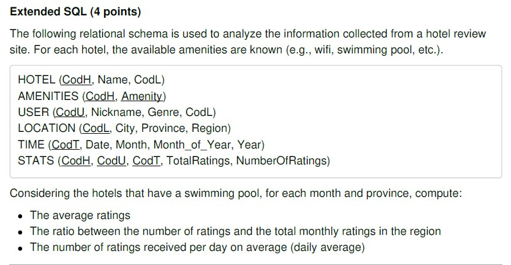
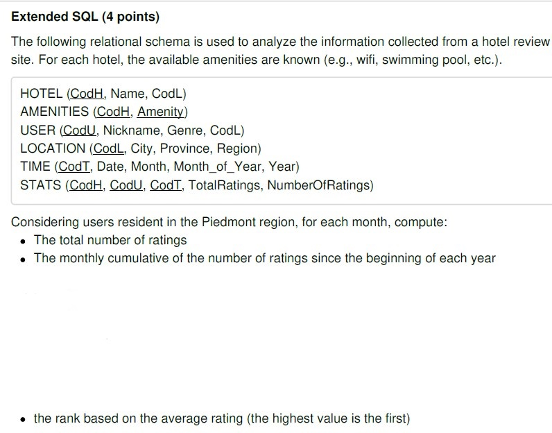
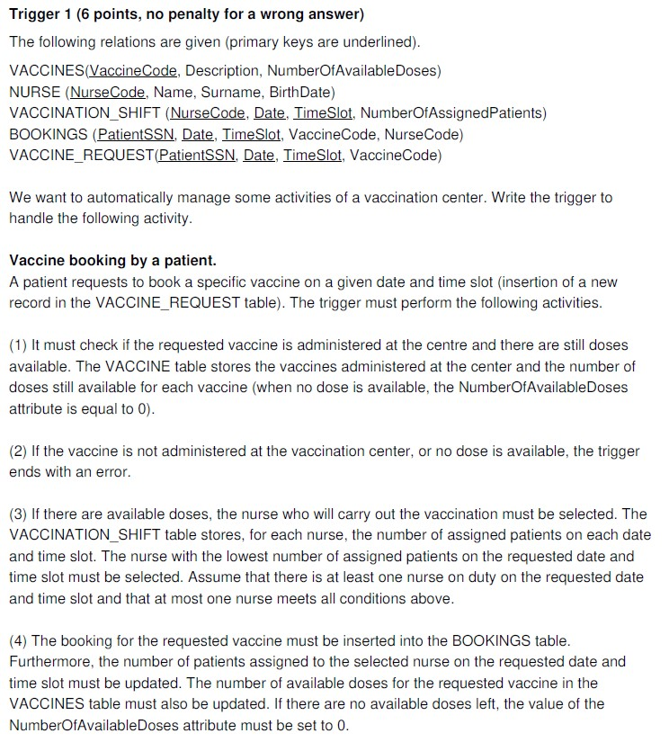
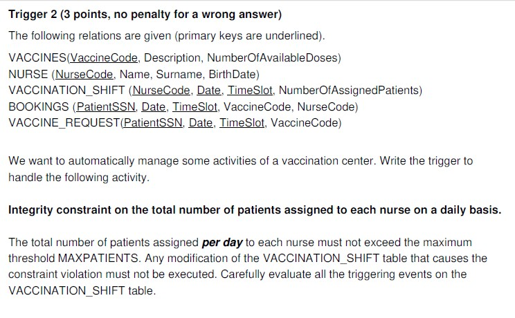

## In [exam.sql](https://github.com/gioele-scaletta/Coding-Exams-Politecnico-di-Torino/blob/main/Data_Science_and_Database_Technology/exam.sql) you can find the code I developed during the Data Science and database Technology exam. The file includes two quick olap queries and a sql trigger. The exam assignment is available below:

## Exercise 1

## Exercise 2

## Exercise 3

## Exercise 4

