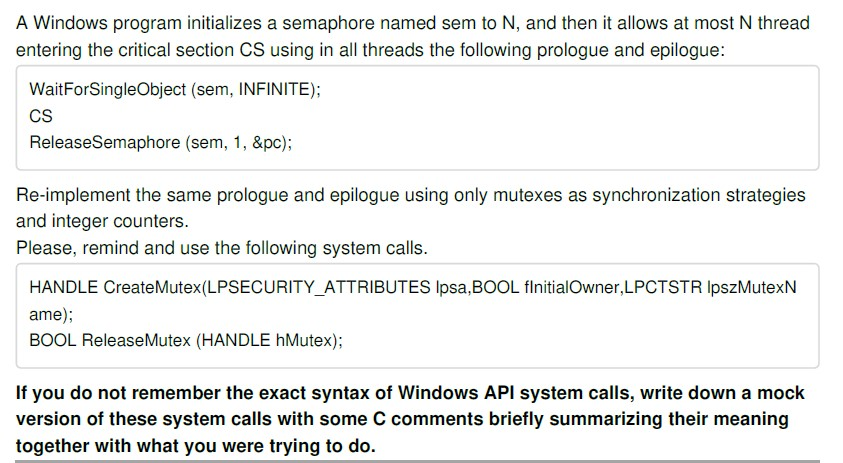
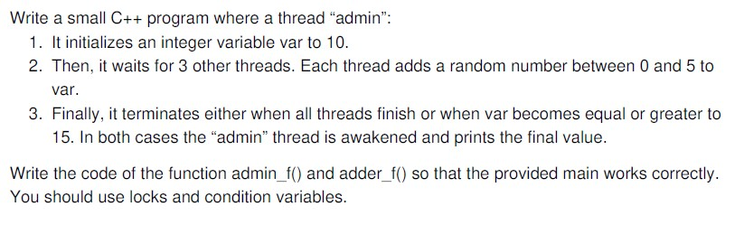
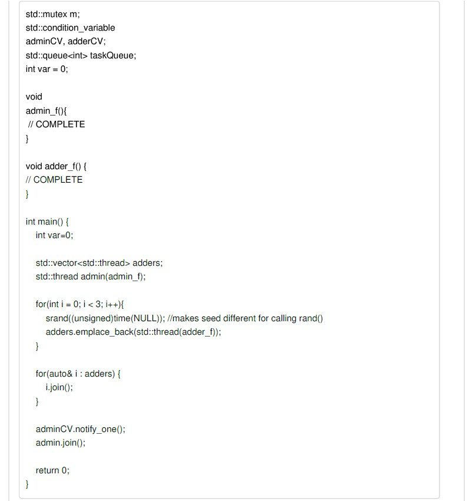
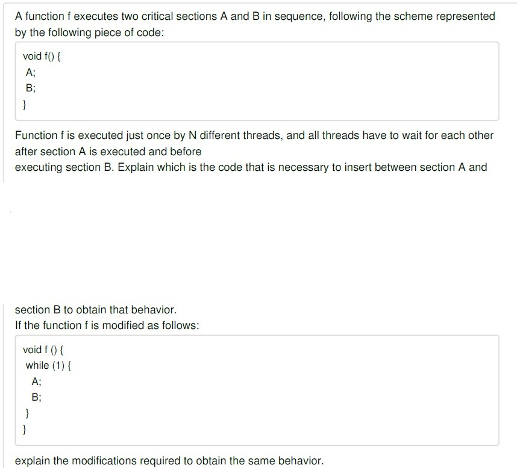
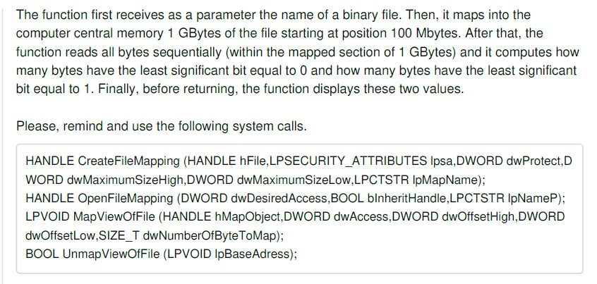

## In [exam.cpp](https://github.com/gioele-scaletta/Coding-Exams-Politecnico-di-Torino/blob/main/System_and_Device_Programming/exam.cpp) you can find the code I developed during the System and Device Programming exam. The assignments are reported below:

## Exercise 1

## Exercise 2

## Exercise 3

## Exercise 5
